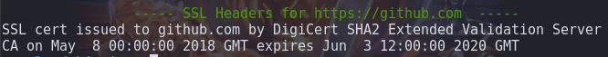

## Request Headers Checker ##
Useful to see what your site may reveal about your security (or lack thereof).

With this ultra light script, you'll see:
* Server response headers (200 / 403 / 301, etc)
* SSL registrant information & legitimacy dates

Screenshot of information returned on github.com:

SSL Information:

Hackers often use scrapers to prowl the web, looking for outdated versions of server applications; what your server returns in headers may give them clues on how to enter your organization without permission.  Use this tool to see what they see, so you know what's giving out too much information & subsequently disable it.

Things that attract the bad guys:
* Outdated versions of Apache, PHP, etc

Ideally, disable the PHP header completely and limit what Apache returns (version numbers are a huge no-no).

If you use something like mod_security, you can even completely change the ServerSignature to something completely unrelated, like `CustomBuild`

* Lack of content security policy

While not inherently insecure, lack of CSP headers leave you vulnerable to XSS, which is a common problem in WordPress sites with hacked extensions.

Your visitors may also have existing exploits on their PC, some malware will rewrite portions of the sites a user visits and inject ads and even more malware; utilizing CSP will prevent them from changing what the user sees while on your site.

* References to WordPress

If you run Wordpress, security by obscurity won't protect you on its own, but it will definitely help make them have to do a bit of extra work to figure out what you're running.  They want easy, quick returns.  Unless you're specifically being targeted, every little bit helps!  *Remove all Wordpress headers!!*  If you do not use xmlrpc, *disable* and/or delete it!  There are plenty of security related extensions, **use them**.

Simply disabling headers that give clues into poor security practices won't protect you, but if your organization has a lot of red tape you have to go through for OS patches and updates, obfuscating much sought after information can buy you a little time.

## [:link: Install Instructions](install-instructions.md) ##
